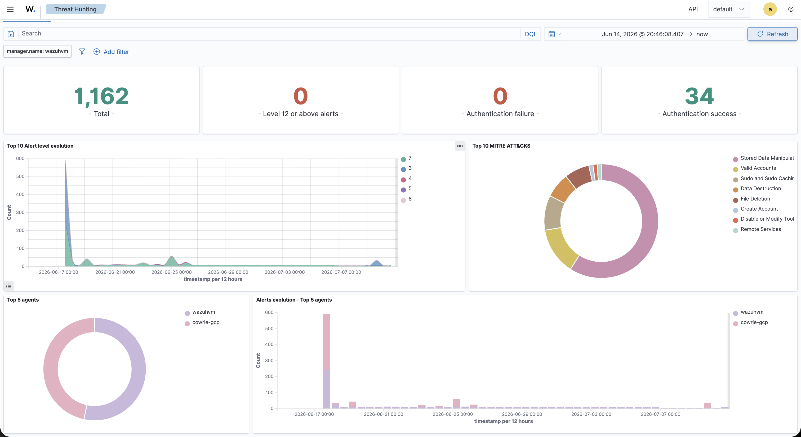
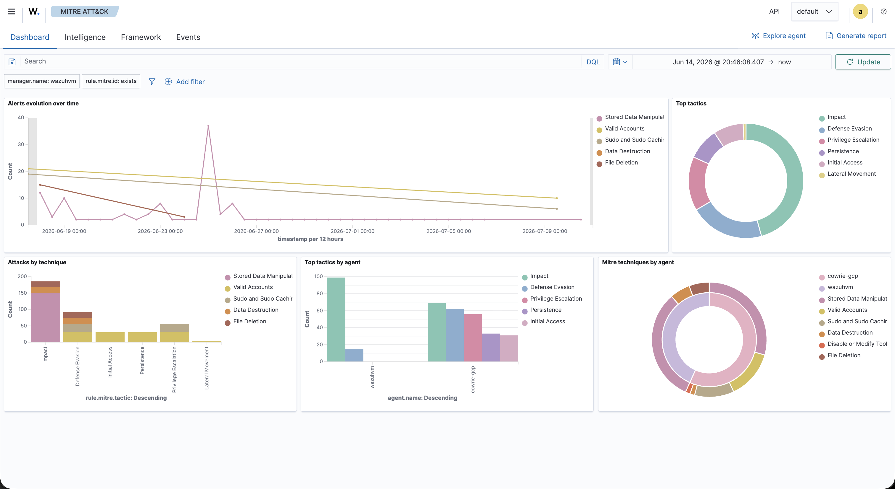
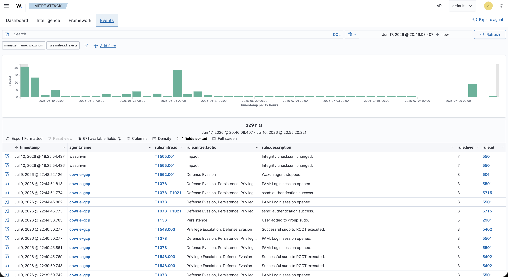
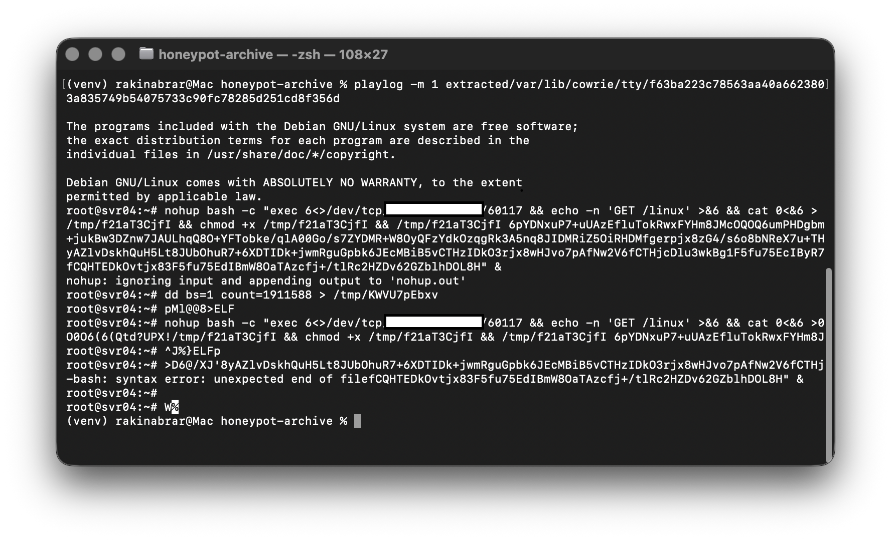
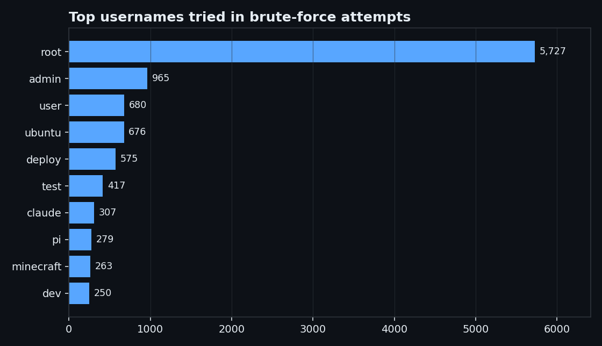
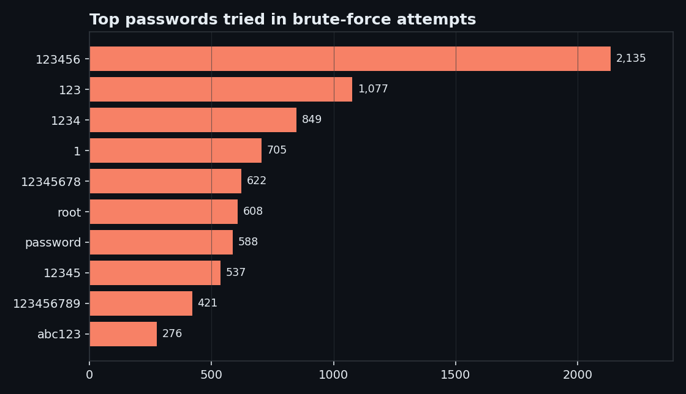
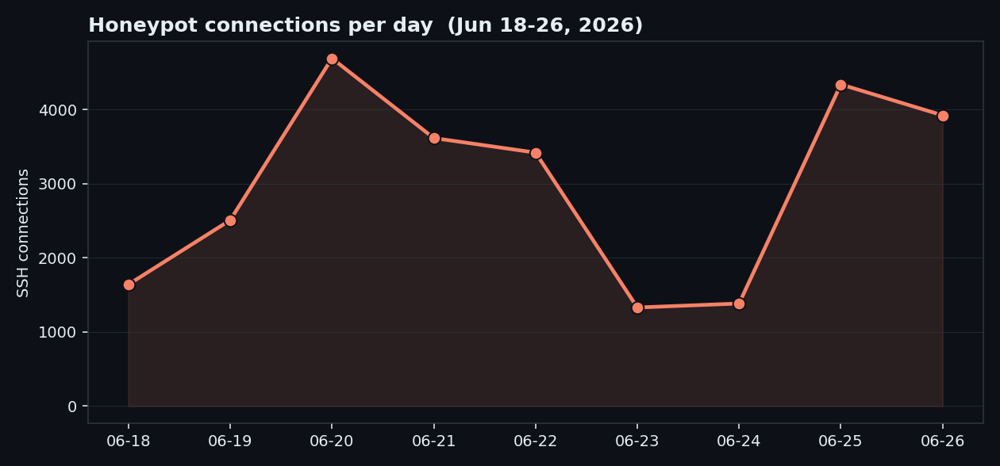

# Cowrie SSH Honeypot on GCP, with Wazuh SIEM

A medium-interaction SSH/Telnet honeypot deployed on Google Cloud Platform to capture real-world attack traffic against internet-facing SSH. Cowrie shipped its logs to a Wazuh SIEM, which correlated the activity and mapped it to the MITRE ATT&CK framework.

> Status: decommissioned. The instance has been torn down. This repo documents the setup, the data collected, and what I took away from it.

## By the numbers

Collection window: June 18 to June 26, 2026 (about 8 days).

- **209,000+** logged events
- **26,869** attacker sessions
- **517** unique source IP addresses
- **25,677** successful logins into the honeypot (Cowrie accepts most credentials by design, so attackers proceed to a fake shell)
- **14** unique malware samples downloaded and captured
- **76** distinct shell commands observed

## Pipeline

Cowrie (honeypot) -> JSON event logs -> Wazuh agent (`cowrie-gcp`) -> Wazuh manager (`wazuhvm`) -> MITRE ATT&CK dashboards.

- **Honeypot:** Cowrie (SSH/Telnet, medium-interaction) on a Google Cloud Platform VM
- **SIEM:** Wazuh, ingesting Cowrie logs and tagging events with MITRE ATT&CK technique IDs
- **Analysis:** Wazuh Threat Hunting and MITRE ATT&CK dashboards, plus session (TTY) replay of captured attacks

## Wazuh SIEM

Cowrie events flowed into Wazuh, which enriched them with ATT&CK techniques and surfaced the dominant tactics: Impact, Defense Evasion, Privilege Escalation, Persistence, and Initial Access.

The MITRE ATT&CK dashboard breaks the same activity down by tactic and technique.

Individual alerts map to specific techniques, for example T1078 (Valid Accounts), T1548.003 (Sudo and Sudo Caching), T1136 (Create Account), and T1565.001 (Stored Data Manipulation).

## Captured attack: malware staging over /dev/tcp

Replaying a captured TTY session shows an attacker pulling a payload without any external tools. The command opens a raw TCP socket with bash's `/dev/tcp`, requests a `/linux` ELF binary from a hard-coded host, writes it to `/tmp`, makes it executable, and runs it with an encoded key argument. This download-and-execute behavior is consistent with a self-propagating SSH botnet.

The command-and-control IP address is redacted. The 14 captured sample hashes are listed in `sample-hashes.txt` and are referenced by hash only; no live binaries are distributed here.

## What the credential data showed

The brute-force traffic went after predictable defaults. Top usernames and passwords attempted:

Usernames were led by `root`, `admin`, `user`, `ubuntu`, and `deploy`. Passwords were led by `123456`, `123`, `1234`, and `password`. Most post-login activity opened with `uname` reconnaissance before any payload attempt.

## What I took away

- How SSH attacks unfold end to end, from brute force to payload delivery, using captured sessions rather than theory
- How to feed honeypot logs into a SIEM and turn raw events into MITRE ATT&CK techniques and tactics
- How Cowrie session replay exposes exactly what an attacker runs once inside
- The operational reality of an internet-facing service: it gets attacked within minutes, continuously

## Repository contents

- `images/`: dashboard and session screenshots used in this README
- `sample-hashes.txt`: SHA-256 hashes of the 14 captured malware samples

## Notes

Attacker command-and-control addresses are redacted. Malware samples are referenced by hash and metadata only; live binaries are not distributed here.
